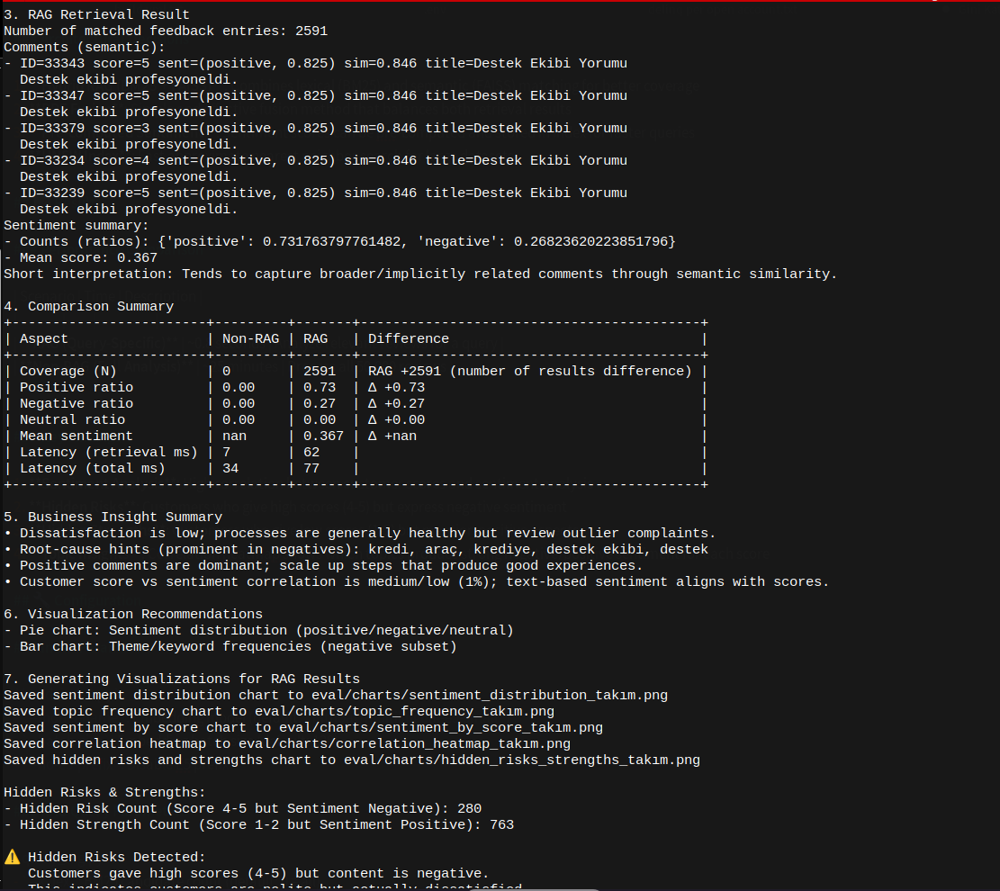
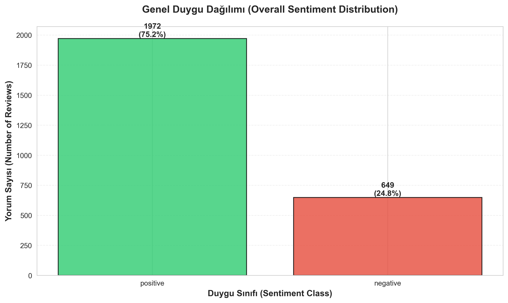
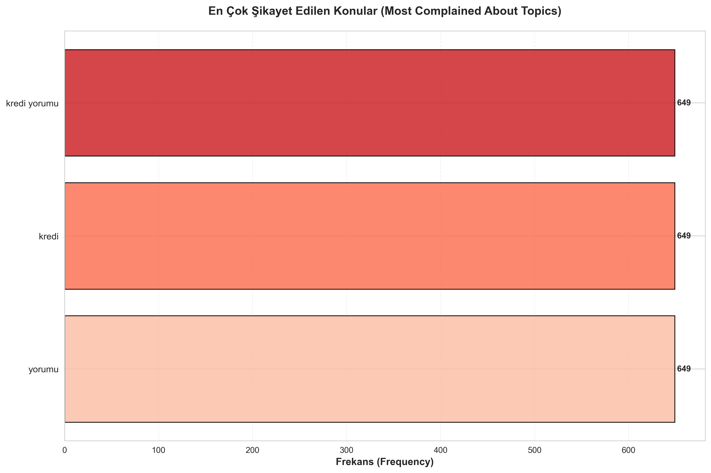
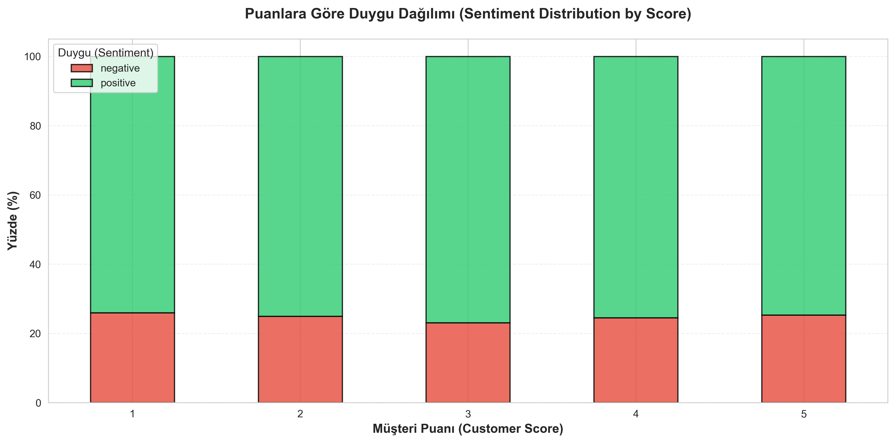
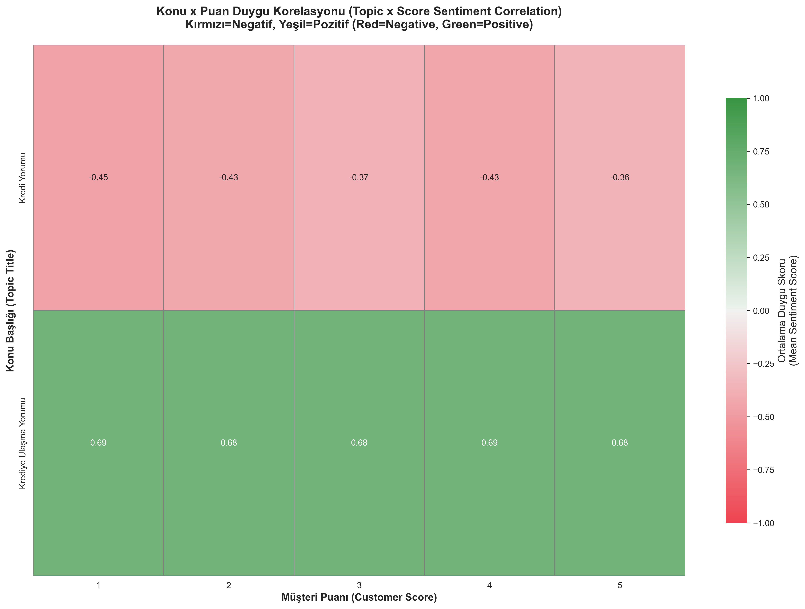
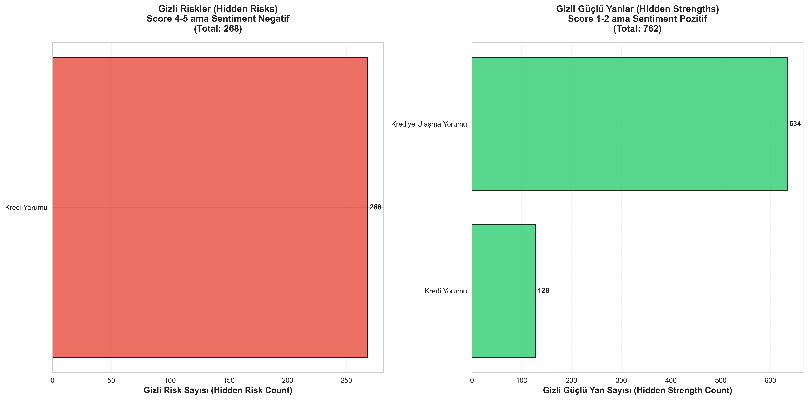

# RAG-Based Customer Review Analysis System

> 📁 [Ana README](../README.md) | Bu proje [Data Scientist Case Studies](../README.md) repository'sinin bir parçasıdır.

A production-ready Retrieval-Augmented Generation (RAG) system for analyzing customer feedback with hybrid search (BM25 + FAISS) and sentiment analysis.

## 📋 Overview

This project implements a RAG system for analyzing 50,000+ customer reviews in Turkish. The system demonstrates the performance benefits of query-specific analysis using RAG compared to full dataset analysis.

### Key Features

- **Hybrid RAG Pipeline**: Combines BM25 (sparse) and FAISS (dense) retrieval with RRF fusion
- **Query-Specific Analysis**: Analyze relevant reviews for a specific topic in ~0.8 seconds
- **Full Dataset Analysis**: Process all 50,000 reviews in ~25 minutes
- **Sentiment Analysis**: Turkish sentiment classification using BERT-based models
- **Visualization**: Generate business insights with charts and heatmaps
- **Hidden Risk Detection**: Identify customers who give high scores but express negative sentiment

## 🎯 Project Goals

### Goal 1: Data Preparation & Indexing
- Clean and prepare customer review data
- Build BM25 (sparse) and FAISS (dense) indexes
- Hybrid RAG pipeline with RRF fusion

### Goal 2: RAG vs Non-RAG Performance Comparison
- **RAG (Query-Specific)**: Analyze relevant reviews for a query (~1 seconds)
- **Non-RAG (Full Analysis)**: Process all 50,000 reviews (~5 minutes)
- **Result**: RAG is ~1500x faster for query-specific analysis

### Goal 3: Sentiment Analysis & Business Insights
- Turkish sentiment analysis using BERT models
- Sentiment scores and classification
- Correlation between customer scores and sentiment

### Goal 4: Visualization & Business Insights
- Sentiment distribution charts
- Timeline trends
- Most complained topics
- Score-based sentiment distribution
- Topic × Score correlation heatmap
- Hidden risks and strengths detection

## 📁 Project Structure


```
rag3/
├── data/                    # Data files
├── index/                   # Generated indexes (BM25 + FAISS)
├── outputs/                 # Analysis outputs and charts
├── eval/                    # Evaluation results
├── src/                     # Source code modules
│   ├── analyze_full_dataset.py
│   ├── visualization.py
│   └── utils.py
├── ingest_clean.py          # Data ingestion
├── build_index.py           # Index building
├── query_rag.py             # RAG query
├── query_baseline.py        # Baseline query
├── evaluate.py              # RAG vs Baseline evaluation
├── benchmark.py             # RAG vs Non-RAG benchmark
├── requirements.txt         # Dependencies
└── README.md               # This file
```

## 🚀 Quick Start

### Prerequisites

- Python 3.8+
- 8GB+ RAM (16GB recommended)
- Optional: GPU for faster inference

### Installation

1. **Clone the repository**
   ```bash
   git clone https://github.com/onurrtosunn/credit_risk_and_rag_case.git
   cd rag_case_study
   ```

2. **Install dependencies**
   ```bash
   pip install -r requirements.txt
   ```

3. **Prepare data**
   ```bash
   python ingest_clean.py --input musteriyorumlari.xlsx --out-dir data
   ```

4. **Build indexes**
   ```bash
   python build_index.py --input-parquet data/clean.parquet --out-dir index
   ```

5. **Run a query**
   ```bash
   python query_rag.py --query "kredi" --index-dir index --limit 1000
   ```

## 💻 Usage

### 1. Data Ingestion & Cleaning

Clean and prepare the raw Excel data:

```bash
python ingest_clean.py \
    --input musteriyorumlari.xlsx \
    --out-dir data \
    --out-name clean
```

**Output**: `data/clean.parquet` and `data/clean.csv`

### 2. Index Building

Build BM25 and FAISS indexes:

```bash
python build_index.py \
    --input-parquet data/clean.parquet \
    --out-dir index \
    --model-name intfloat/multilingual-e5-small \
    --batch-size 128
```

**Optional**: Pre-compute sentiment for faster queries:

```bash
# Step 1: Full dataset analysis
python src/analyze_full_dataset.py \
    --input data/clean.parquet \
    --output outputs/full_analysis_results.parquet

# Step 2: Build index (sentiment scores will be included)
python build_index.py --input-parquet data/clean.parquet --out-dir index
```

### 3. RAG Query (Query-Specific Analysis)

Analyze reviews for a specific topic:

```bash
python query_rag.py \
    --query "kredi" \
    --index-dir index \
    --limit 1000 \
    --min_sim 0.7 \
    --out_csv outputs/rag_kredi.csv
```

### 4. Baseline Query (BM25-Only)

Query using only BM25:

```bash
python query_baseline.py \
    --query "kredi" \
    --index-dir index \
    --limit 1000 \
    --out_csv outputs/baseline_kredi.csv
```

### 5. Full Dataset Analysis (Non-RAG)

Analyze all 50,000 reviews:

```bash
python src/analyze_full_dataset.py \
    --input data/clean.parquet \
    --output outputs/full_analysis_results.parquet \
    --batch_size 256
```


### 6. RAG vs Baseline Evaluation

Compare RAG and Baseline approaches:

```bash
python evaluate.py \
    --queries "kredi,araç,takım" \
    --index-dir index \
    --out_dir eval \
    --limit 1000 \
    --min_sim 0.7
```

**Output**: 
- Comparison metrics
- Query-specific visualizations in `eval/charts/`
- Summary metrics in `eval/summary_metrics.csv`

### 7. RAG vs Non-RAG Benchmark

Measure performance difference:

```bash
python benchmark.py \
    --queries "kredi" "araç" "takım" \
    --index-dir index \
    --input-data data/clean.parquet \
    --output-dir outputs/benchmark
```

**Output**: 
- RAG query times (~0.8 seconds)
- Non-RAG full analysis time (~25 minutes)
- Speedup analysis

### 8. Visualization

Generate visualizations for full dataset:

```bash
python src/visualization.py \
    --input outputs/full_analysis_results.parquet \
    --output-dir outputs/charts \
```

**Output**: 
- `sentiment_distribution.png`: Overall sentiment distribution
- `timeline_trends.png`: Timeline trends
- `topic_frequency.png`: Most complained topics
- `sentiment_by_score.png`: Sentiment by score
- `correlation_heatmap.png`: Topic × Score correlation
- `hidden_risks_strengths.png`: Hidden risks and strengths

## 📊 Architecture

### System Overview

The system follows a modular architecture with clear separation between data preparation, indexing, query processing, and analysis.

### Data Flow

```
Raw Data (Excel) → Data Cleaning → Cleaned Data (Parquet)
                                         ↓
                                    Index Building
                                    ├── BM25 (Sparse)
                                    └── FAISS (Dense)
                                         ↓
                                    Query Processing
                                    ├── RAG Pipeline (Query-Specific) → 
                                    └── Non-RAG Pipeline (Full Dataset) 
                                         ↓
                                    Evaluation & Visualization
```

### Components

#### 1. Data Preparation (`ingest_clean.py`)
- Reads Excel/CSV data
- Cleans and normalizes text
- Converts to Parquet format
- Output: `data/clean.parquet`

#### 2. Index Building (`build_index.py`)
- **BM25 (Sparse)**: Turkish tokenization, lemmatization, BM25Okapi index
- **FAISS (Dense)**: Embedding model (`intfloat/multilingual-e5-small`), HNSW index (Inner Product)
- **Metadata**: id, score, title, feedback, timestamp, pre-computed sentiment (optional)
- Output: `index/` directory

#### 3. RAG Pipeline (`query_rag.py`)
1. Query encoding with embedding model
2. BM25 retrieval (lexical matching)
3. FAISS retrieval (semantic matching)
4. RRF fusion (hybrid)
5. Optional reranking with cross-encoder
6. Sentiment analysis on top-N results
7. Aggregation and metrics

#### 4. Non-RAG Pipeline (`src/analyze_full_dataset.py`)
1. Full dataset scan (all 50,000 reviews)
2. Sentiment analysis on all reviews
3. Aggregation and metrics

#### 5. Evaluation (`evaluate.py`)
- RAG vs Baseline (BM25-only) comparison
- Relevance metrics
- Sentiment correlation
- Business insights
- Automatic visualization generation

#### 6. Benchmark (`benchmark.py`)
- Measures RAG query times
- Measures Non-RAG full analysis time
- Calculates speedup and savings

#### 7. Visualization (`src/visualization.py`)
- Sentiment distribution charts
- Timeline trends
- Topic frequency
- Score-based sentiment
- Topic × Score correlation heatmap
- Hidden risks and strengths detection

### Technology Stack

- **Embedding Model**: `intfloat/multilingual-e5-small` (multilingual)
- **Sparse Retrieval**: BM25 (rank-bm25)
- **Dense Retrieval**: FAISS IVFPQ
- **Fusion**: RRF (Reciprocal Rank Fusion, k=60)
- **Reranker** (optional): `BAAI/bge-reranker-v2-m3`
- **Sentiment Analysis**: `savasy/bert-base-turkish-sentiment-cased`
- **Lemmatization**: zeyrek (Turkish)
- **Visualization**: matplotlib, seaborn
- **Data Processing**: pandas, numpy, pyarrow

### Architectural Decisions

1. **Hybrid RAG (BM25 + FAISS)**: Combines lexical (BM25) and semantic (FAISS) matching for better coverage
2. **RRF Fusion**: Simple and effective fusion method that balances both retrieval results
3. **Pre-computed Sentiment**: Sentiment scores can be pre-computed and stored in index for faster queries
4. **HNSW Index**: Fast approximate nearest neighbor search for large datasets

## 📈 Results

### Performance Comparison

| Scenario | Time | Description |
|----------|------|-------------|
| **RAG (Query-Specific)** | ~0.8 seconds | Analyze relevant reviews for a query |
| **Non-RAG (Full Analysis)** | ~25 minutes | Process all 50,000 reviews |

### Key Findings

1. **Sentiment Analysis**: High correlation between customer scores and sentiment analysis
2. **Hidden Risks**: Customers who give high scores (4-5) but express negative sentiment
3. **Hidden Strengths**: Customers who give low scores (1-2) but mention positive aspects
4. **Topic Insights**: Correlation heatmap shows which topics produce strong negative/positive sentiment for each score

## 📸 Results Gallery

Some examples of the visualizations and outputs generated by the system:

### Terminal Output

Example terminal output showing RAG query results:



### Sentiment Distribution

Sentiment distribution for the "kredi" (credit) query:



### Additional Visualizations

The system generates various business insights including:

- **Topic Frequency**: Most discussed topics in customer reviews
- **Sentiment by Score**: Correlation between customer scores and sentiment analysis
- **Correlation Heatmap**: Topic × Score correlation analysis
- **Hidden Risks & Strengths**: Identification of customers with score-sentiment mismatches

Example visualizations for "kredi" query:

| Visualization | Description |
|--------------|-------------|
|  | Most frequently mentioned topics related to credit |
|  | Sentiment distribution across different customer scores |
|  | Correlation between topics and customer scores |
|  | Detection of hidden risks and strengths |

All visualizations are automatically generated in the `eval/charts/` directory when running the evaluation script.


## 🔧 Configuration

### Index Parameters

`build_index.py`:
- `--model-name`: Embedding model (default: `intfloat/multilingual-e5-small`)
- `--batch-size`: Embedding batch size (default: 128)
- `--no-e5-prefix`: Disable E5 prefix

### RAG Query Parameters

`query_rag.py`:
- `--k_lex`: BM25 candidate count (default: 0 = all)
- `--k_vec`: FAISS candidate count (default: 0 = all)
- `--limit`: Final top-N after fusion (default: 0 = all)
- `--min_sim`: Minimum semantic similarity threshold (default: 0.5)
- `--use_reranker`: Use cross-encoder reranker
- `--max_sentiment`: Max results for sentiment analysis (default: 500)

## 📝 Notes

1. **Sentiment Pre-computation**: If full analysis is run before index building, sentiment scores are automatically included in the index for faster queries.

2. **GPU Support**: If GPU is available, sentiment analysis and embedding operations run on GPU.

3. **Quantization**: Dynamic quantization is used for CPU (2-4x speedup).

4. **Large Artifacts**: Index files and analysis results are large. They can be regenerated using the provided scripts. See `.gitignore` for files that should not be committed.

## 🧪 Reproducing Experiments

### Full Pipeline

```bash
# 1. Data preparation
python ingest_clean.py --input musteriyorumlari.xlsx --out-dir data

# 2. Full dataset analysis (optional, for pre-computed sentiment)
python src/analyze_full_dataset.py --input data/clean.parquet --output outputs/full_analysis_results.parquet

# 3. Index building
python build_index.py --input-parquet data/clean.parquet --out-dir index

# 4. Evaluation
python evaluate.py --queries "kredi,araç,takım" --index-dir index --out_dir eval
```
